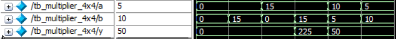
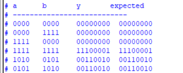
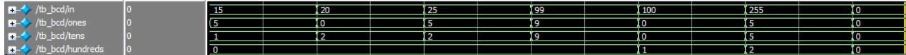
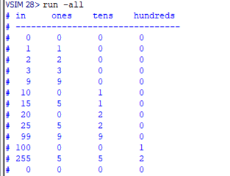
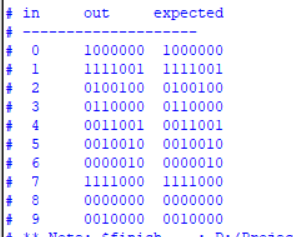
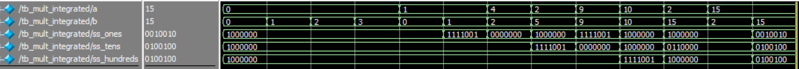
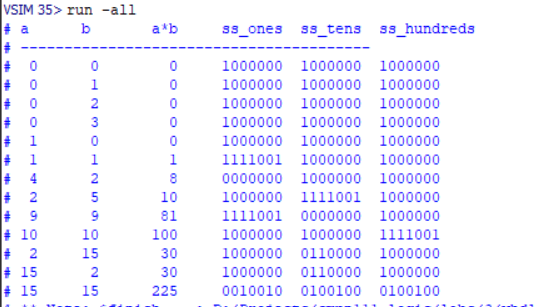

# Lab #3 Requirement

Name: Khaled Mamdouh Mohamed Fadel  
ID: 1190321

## Table of Contents

1. [Info about the requirement](#1-info-about-the-requirement)
1. [Running the Simulation](#2-running-the-simulation)
1. [Simulation Screenshots](#3-screenshots)

## 1. Info about the requirement

The requirement is to design a 4x4 multiplier and to output the result on a 7-segment display. The design should be done using Verilog and the simulation should be done using ModelSim or Quartus. More details about the requirement can be found in the [Lab #3 Requirement](Lab03_req.pdf) file.

## 2. Running the Simulation

The simulation can be run using ModelSim or Quartus. You would need to create a new project and add the [verilog files](verilog-files/) to it. Then, you could simulate the design or the testbench.

## 3. Screenshots

In this section, I will show some screenshots of the simulation of the testbenches on ModelSim for the following modules:

1. [4x4 Multiplier](#31-4x4-multiplier)
1. [BCD Encoder](#32-bcd-encoder)
1. [Seven-Segment Decoder](#33-seven-segment-decoder)
1. [Integrated Design](#34-integrated-design)

### 3.1. 4x4 Multiplier

When the testbench is simulated, the following waveform is generated: 

And the following is the output of the simulation: 

### 3.2. BCD Encoder

When the testbench is simulated, the following waveform is generated: 

And the following is the output of the simulation: 

### 3.3. Seven Segment Decoder

When the testbench is simulated, the following waveform is generated: 

And the following is the output of the simulation:   

### 3.4. Integrated Design

When the testbench is simulated, the following waveform is generated: 

And the following is the output of the simulation: 
